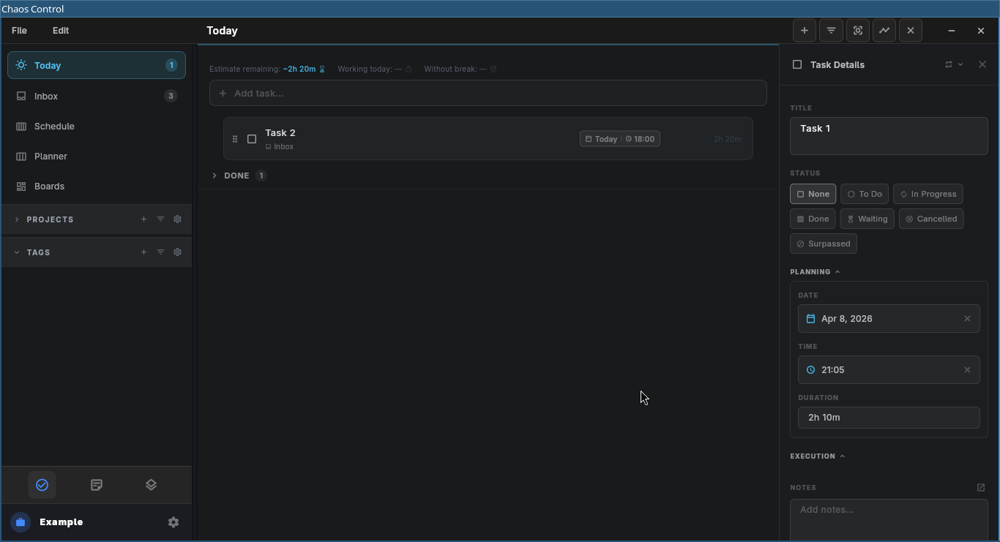
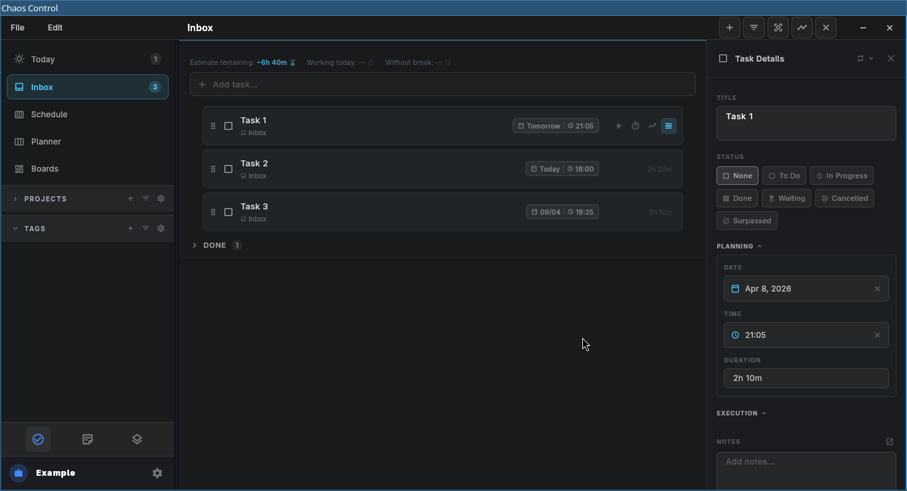
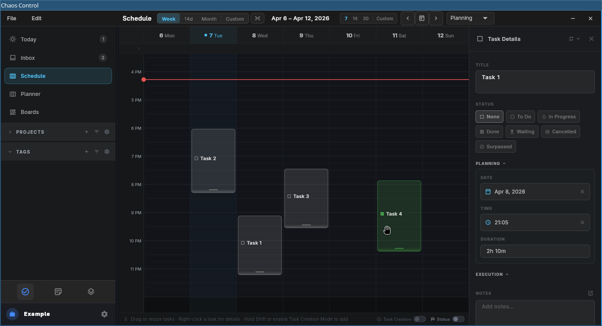
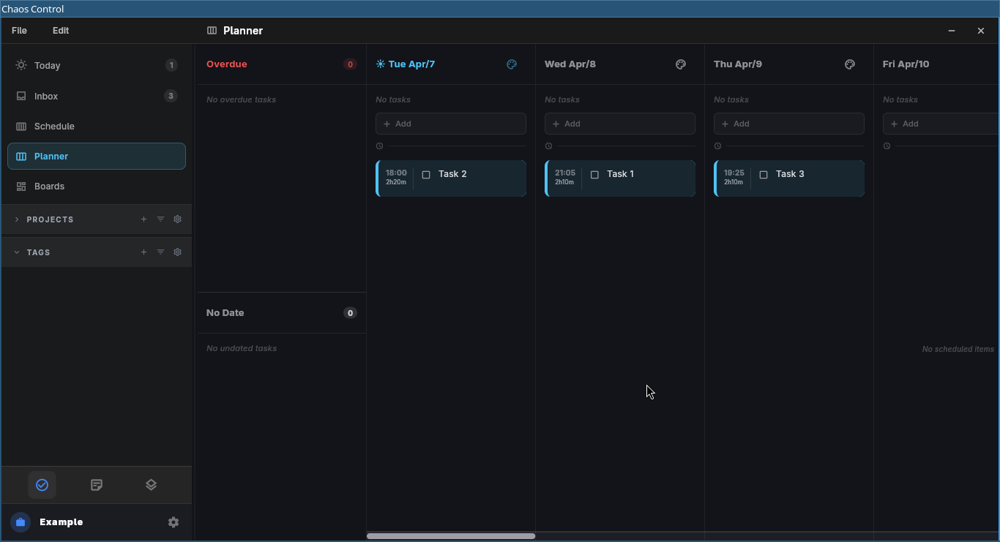
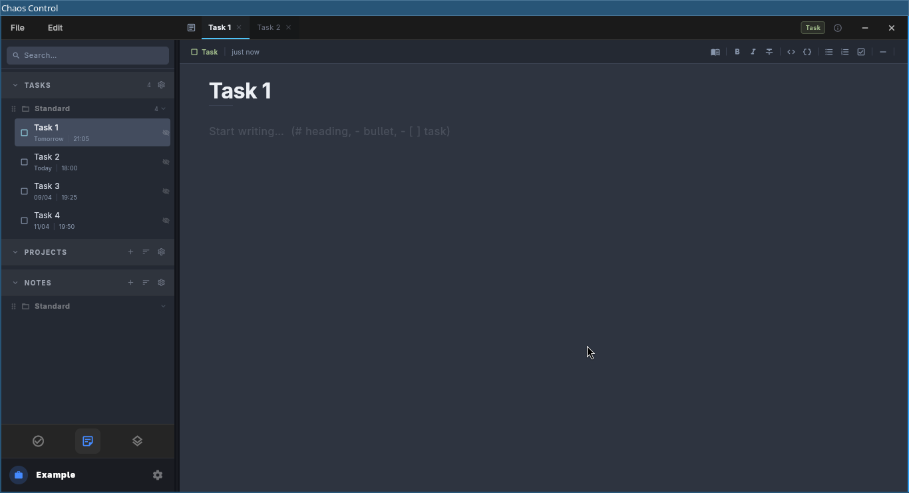
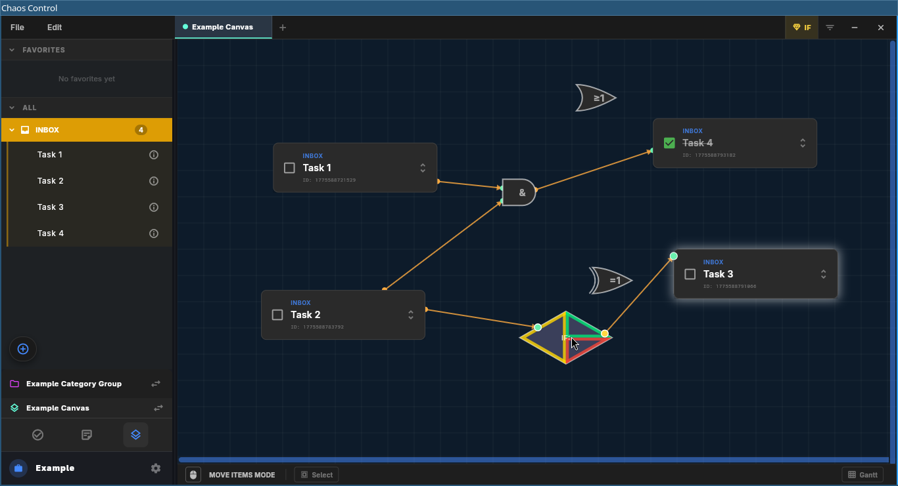

# Chaos Control

## About
The software still is in Alpha.

The core idea is to combine functionalities of SuperProductivity, Obsidian and an infinite canvas for tasks.

## Screenshots
| | | | | | |
|---|---|---|---|---|---|
| | |  |  |  |  |
